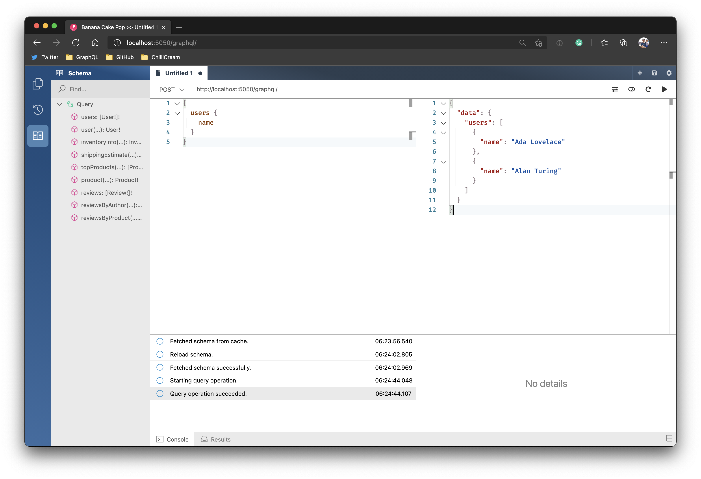
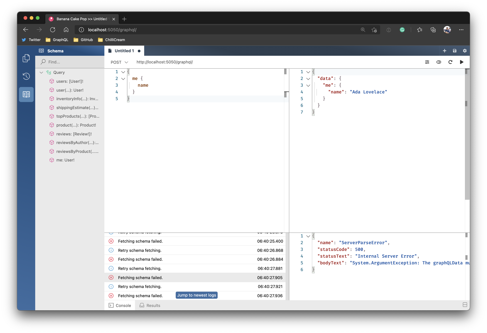
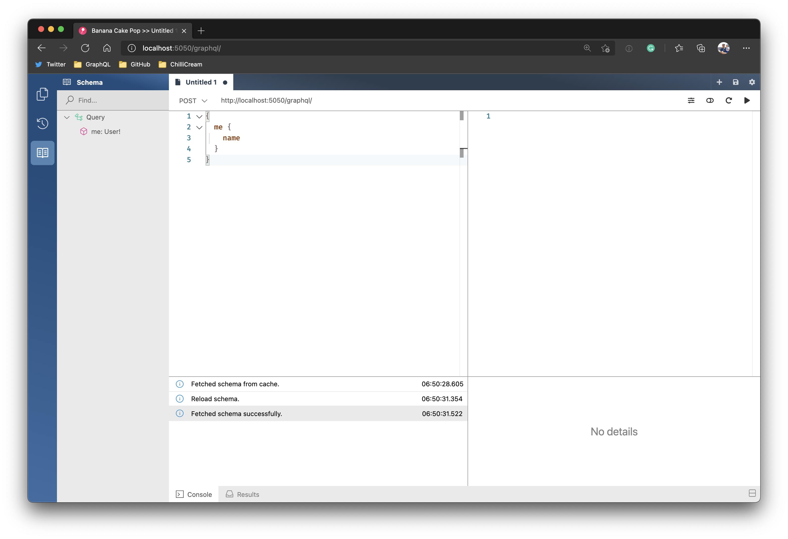
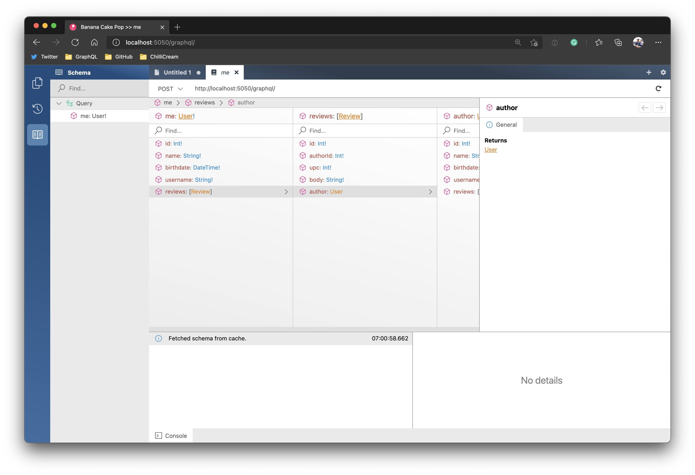
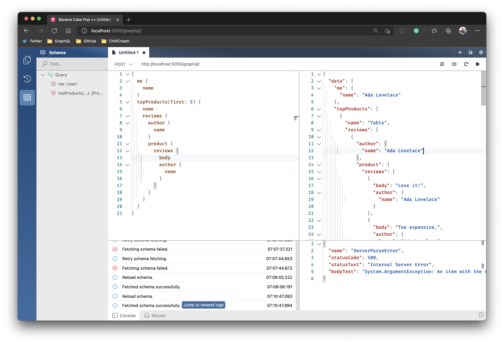
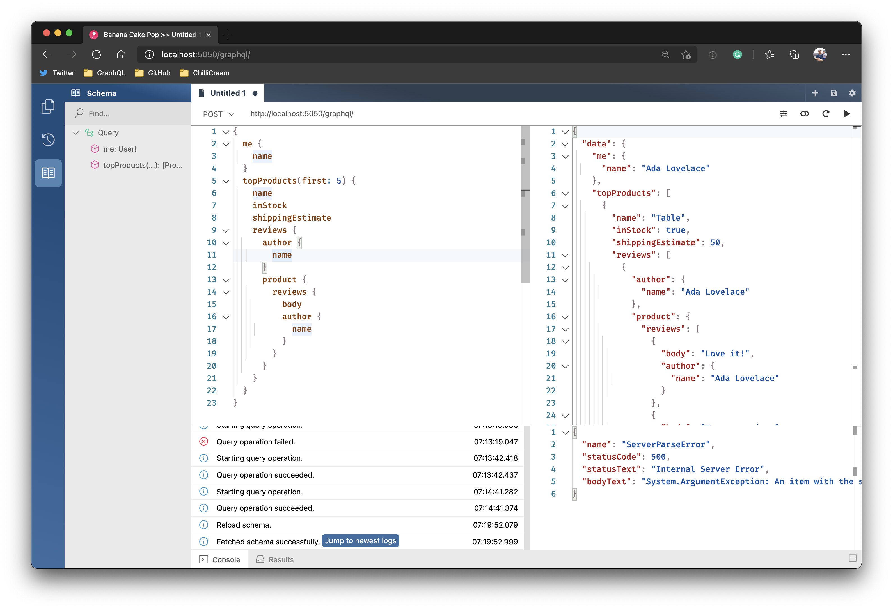

# Create a basic GraphQL gateway

## Create server project

1. Create a new project for our GraphQL gateway.
   1. `dotnet new web -n gateway`
   1. `dotnet sln add gateway`

## Add GraphQL and Stitching

1. Add a reference to the NuGet package package `HotChocolate.AspNetCore` version `11.0.8`.
   1. `dotnet add gateway package HotChocolate.AspNetCore --version 11.0.8`
1. Add a reference to the NuGet package package `HotChocolate.Stitching` version `11.0.8`.
   1. `dotnet add gateway package HotChocolate.Stitching --version 11.0.8`

## Configure basic gateway.

1. Head over to the `Startup.cs` and add the following constants that shall represent our downstream services.

   ```csharp
   public const string Accounts = "accounts";
   public const string Inventory = "inventory";
   public const string Products = "products";
   public const string Reviews = "reviews";
   ```

1. Next, we need to configure HTTP connections for each downstream service.

   ```csharp
   public void ConfigureServices(IServiceCollection services)
   {
      services.AddHttpClient(Accounts, c => c.BaseAddress = new Uri("http://localhost:5051/graphql"));
      services.AddHttpClient(Inventory, c => c.BaseAddress = new Uri("http://localhost:5052/graphql"));
      services.AddHttpClient(Products, c => c.BaseAddress = new Uri("http://localhost:5053/graphql"));
      services.AddHttpClient(Reviews, c => c.BaseAddress = new Uri("http://localhost:5054/graphql"));
   }
   ```

1. Last, we need to add the GraphQL server configuration.

   ```csharp
   public void ConfigureServices(IServiceCollection services)
   {
      services.AddHttpClient(Accounts, c => c.BaseAddress = new Uri("http://localhost:5051/graphql"));
      services.AddHttpClient(Inventory, c => c.BaseAddress = new Uri("http://localhost:5052/graphql"));
      services.AddHttpClient(Products, c => c.BaseAddress = new Uri("http://localhost:5053/graphql"));
      services.AddHttpClient(Reviews, c => c.BaseAddress = new Uri("http://localhost:5054/graphql"));

      services
         .AddGraphQLServer()
         .AddRemoteSchema(Accounts)
         .AddRemoteSchema(Inventory)
         .AddRemoteSchema(Products)
         .AddRemoteSchema(Reviews);
   }
   ```

## Add routing for the GraphQL gateway

In order to run queries against our very basic GraphQL gateway we need to add some routing configuration. For this we stay in the `Startup.cs` and will need rewrite the `Configure` method a bit.

1. Replace `app.UseEndpoints(endpoints => ...` with the following configuration:

   ```csharp
   app.UseEndpoints(endpoints =>
   {
      endpoints.MapGraphQL();
   });
   ```

1. Further, we need to update out tye configuration so we can run our gateway. Append the following to the tye.yaml.

   ```yaml
   - name: gateway
     project: gateway/Gateway.csproj
     bindings:
       - port: 5050
   ```

## Test the gateway

1. Restore the dotnet tools.
   1. dotnet tool restore
1. Run tye to start the gateway and its downstream services.
   1. dotnet tye run --watch
1. Open a browser and and go to `http://localhost:5050/graphql`

   

# Rewrite Schemas

In order to create a schema that really reflects our business model we need to rewrite the downstream services into a new schema that really integrates the types from the services with each other.

## Add schema configuration

1. Create a new file called `Stitching.graphql` which shall be located in the root of the gateway project.

1. Add the following GraphQL SDL snippet into the `Stitching.graphql` file.

   ```graphql
   extend type Query {
     me: User! @delegate(schema: "accounts", path: "user(id: 1)")
   }
   ```

   > This piece of GraphQL will extend the current root type and delegate calls to it to the `Query` type of the schema `accounts` and more specifically to the field `user`.

1. Go to your `gateway.csproj` and add the following to an `ItemGroup` so that changes to the `Stitching.graphql` file are tracked.

   ```xml
   <ItemGroup>
     <Watch Include="Stitching.graphql" />
   </ItemGroup>
   ```

1. Head over to the gateway `Startup.cs` and add `.AddTypeExtensionsFromFile("./Stitching.graphql")` to our GraphQL server configuration.

   ```csharp
   services
      .AddGraphQLServer()
      .AddRemoteSchema(Accounts)
      .AddRemoteSchema(Inventory)
      .AddRemoteSchema(Products)
      .AddRemoteSchema(Reviews)
      .AddTypeExtensionsFromFile("./Stitching.graphql");
   ```

1. Head over to your browser and reload your schema to review the changes. We now can see our new field. Try to write a query against this new field.

   

## Build out schema

We now have an idea how we really can rewrite our schemas to a completely new schema. In this section we will fully transform our schema.

1. Remove the noise by removing the auto-stitched root fields.

   ```csharp
   services
      .AddGraphQLServer()
      .AddRemoteSchema(Accounts, ignoreRootTypes: true)
      .AddRemoteSchema(Inventory, ignoreRootTypes: true)
      .AddRemoteSchema(Products, ignoreRootTypes: true)
      .AddRemoteSchema(Reviews, ignoreRootTypes: true)
      .AddTypeExtensionsFromFile("./Stitching.graphql");
   ```

> The above configuration will now ignore any root types from the downstream services `ignoreRootTypes: true`.

1. Next we need to introduce a new empty `Query` type on the gateway that we can use to extend `.AddQueryType(d => d.Name("Query"))`.

   ```csharp
   services
      .AddGraphQLServer()
      .AddQueryType(d => d.Name("Query"))
      .AddRemoteSchema(Accounts, ignoreRootTypes: true)
      .AddRemoteSchema(Inventory, ignoreRootTypes: true)
      .AddRemoteSchema(Products, ignoreRootTypes: true)
      .AddRemoteSchema(Reviews, ignoreRootTypes: true)
      .AddTypeExtensionsFromFile("./Stitching.graphql");
   ```

1. Head over to your browser and reload your schema to review the changes.

   

1. Integrate the reviews with the user by by extending the `User` type. For this place the following piece of GraphQL SDL into your `Stitching.graphql`.

   ```graphql
   extend type User {
     reviews: [Review]
       @delegate(schema: "reviews", path: "reviewsByAuthor(authorId: $fields:id)")
   }
   ```

1. Next, lets do this from the other side by integrating the user with the reviews.

   ```graphql
   extend type Review {
     author: User @delegate(schema: "accounts", path: "user(id: $fields:authorId)")
   }
   ```

1. Head over to your browser and reload your schema to review the changes.

   

1. Now, lets introduce a top-level access to our products by adding the following snippet to the `Query` type in `Stitching.graphql`.

   ```graphql
   extend type Query {
     me: User! @delegate(schema: "accounts", path: "user(id: 1)")
     topProducts(first: Int): [Product] @delegate(schema: "products")
   }
   ```

1. Again, we want to fully integrate those entities with the entities that we already have. For this we now integrate the product with the review by adding the following snippet to our `Review` type in `Stitching.graphql`.

   ```graphql
   extend type Review {
     author: User @delegate(schema: "accounts", path: "user(id: $fields:authorId)")
     product: Product
       @delegate(schema: "products", path: "product(upc: $fields:upc)")
   }
   ```

1. The, same we want to do from the other side by adding a field to products that returns all the review that we have for a give product.

   ```graphql
   extend type Product {
     reviews: [Review]
       @delegate(schema: "reviews", path: "reviewsByProduct(upc: $fields:upc)")
   }
   ```

1. Head over to your browser and reload your schema to review the changes.

   

1. We also want to integrate the stock and shipping information to our product. The inventory info is not an object that we want to integrate into our schema. We only want to grab one specific field from it. For this we will do a deep stitch. Add the following snippet to your `Product` type in the `Stitching.graphql`

   ```graphql
   extend type Product {
     reviews: [Review]
       @delegate(schema: "reviews", path: "reviewsByProduct(upc: $fields:upc)")
     inStock: Boolean
       @delegate(
         schema: "inventory"
         path: "inventoryInfo(upc: $fields:upc).isInStock"
       )
   }
   ```

1. Last let us integrate the shipping estimates by adding the following snippet to your `Product` type in the `Stitching.graphql`.

   ```graphql
   extend type Product {
     reviews: [Review]
       @delegate(schema: "reviews", path: "reviewsByProduct(upc: $fields:upc)")
     inStock: Boolean
       @delegate(
         schema: "inventory"
         path: "inventoryInfo(upc: $fields:upc).isInStock"
       )
     shippingEstimate: Int
       @delegate(
         schema: "inventory"
         path: "shippingEstimate(price: $fields:price weight: $fields:weight)"
       )
   }
   ```

1. Head over to your browser and reload your schema to review the changes.

   